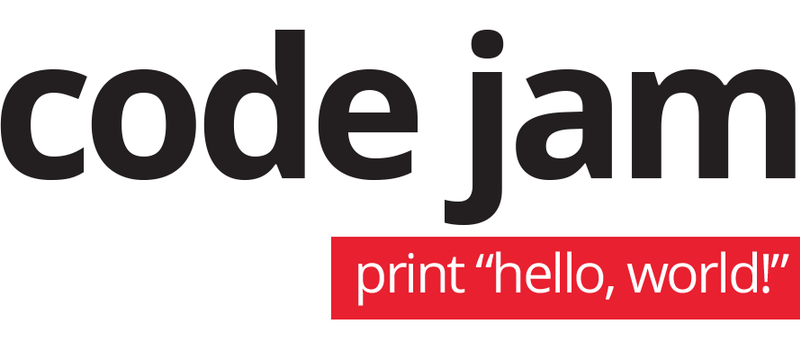

# CodeJam Problems

# Description

This repository includes my solutions to the problems of the Google Code Jam
competitions up to year 2021  made on a second thought.
The sources are in C++, and each source file contains a description of the algorithm used.
The C++ packages in the *Problems* directory contain source code grouped by Code Jam edition and round.
Unless otherwise noted, everything is judged as correct under practice mode.

## Code Jam 2019

* Qualification round:
    * **Foregone Solution**
    * **You Can Go Your Own Way**
    * **Cryptopangrams** 
* Round 1B:
    * **Manhattan Crepe Cart**
    * **Draupnir**
    * **Fair Fight**
 # Contributions are accepted!

